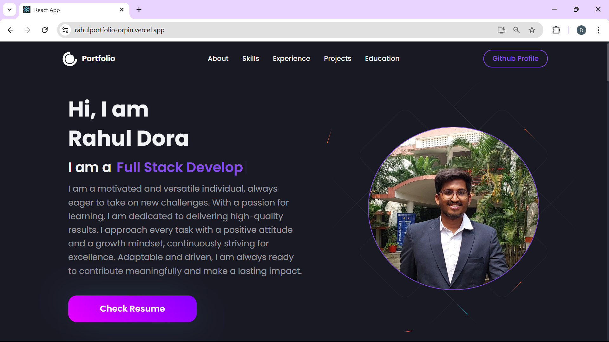
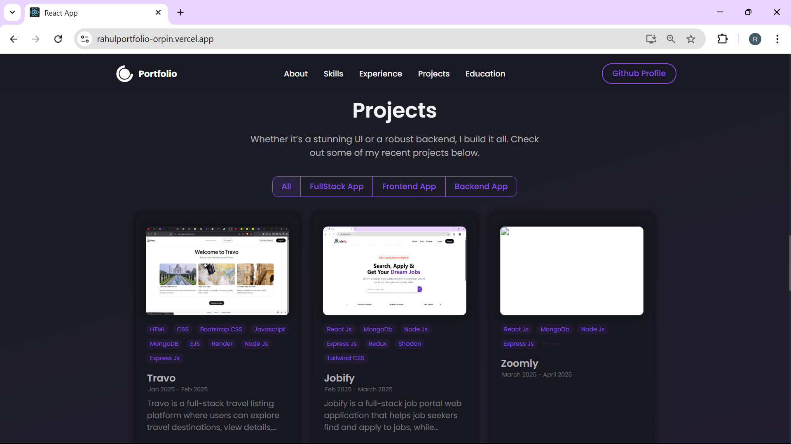
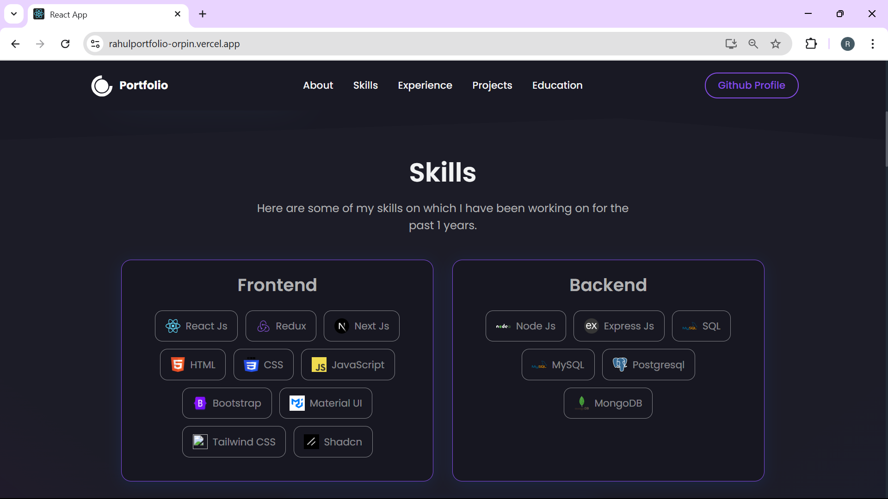
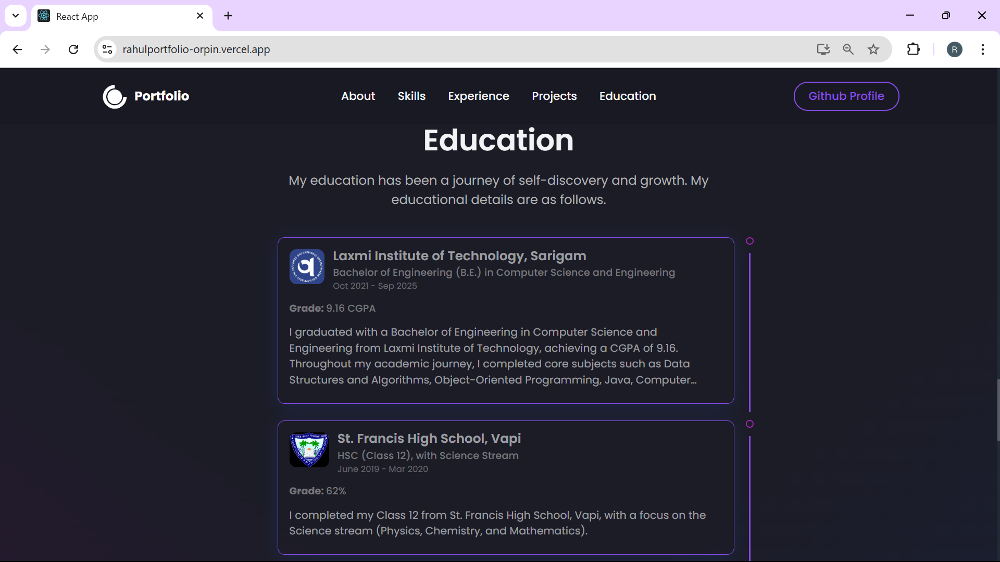
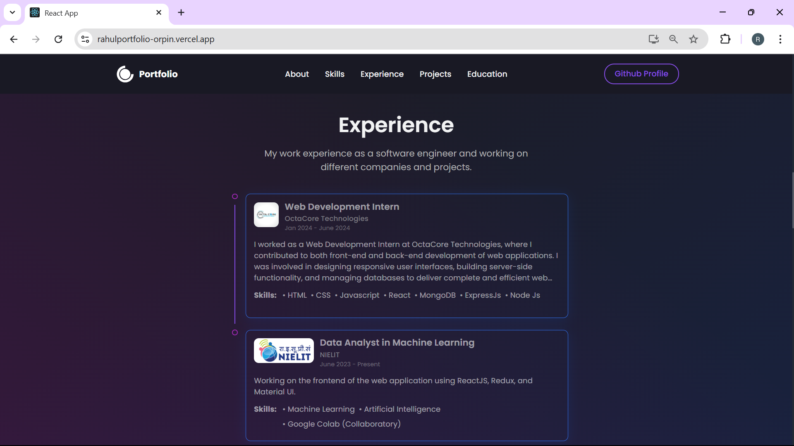
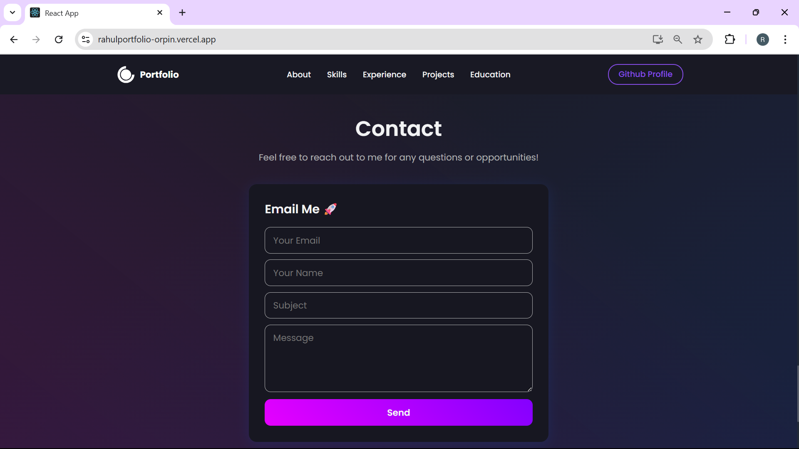
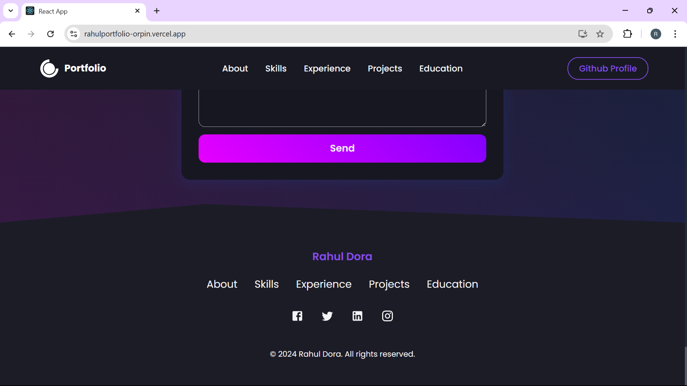

# 🧑‍💻 Rahul Dora - Developer Portfolio

Welcome to my personal **developer portfolio** built to showcase my skills, projects, and passion for web development. This project is crafted using modern frontend technologies and designed to be clean, responsive, and engaging.

---

## 🌟 Features

- 📌 **Home Page** – Personal intro, skills, and tagline.
- 🧾 **Projects Section** – Live project links and source code.
- 🎓 **Education Section** – Academic background and certifications.
- 🧑‍💼 **Experience Section** – Internships and work history.
- 🧰 **Tech Stack** – Highlights technologies I work with.
- 📞 **Contact Section** – Email, social links, and resume.
- 📱 Fully **Responsive** – Works across all devices.

---

## 🛠️ Built With

- HTML5 / CSS3
- JavaScript
- React.js 
- Git & GitHub

---

## 🖼️ Screenshots

### 🏠 Home Page  
  
 

### 💼 Projects Section  
  
 

### 🧠 Skills Section  
  
 

### 🎓 Education Section  
  
 

### 🧑‍💼 Experience Section  
  
 

### 📞 Contact Section  
  
 

### 🔚 Footer Section  
  
 

## 🔗 Live Web App

